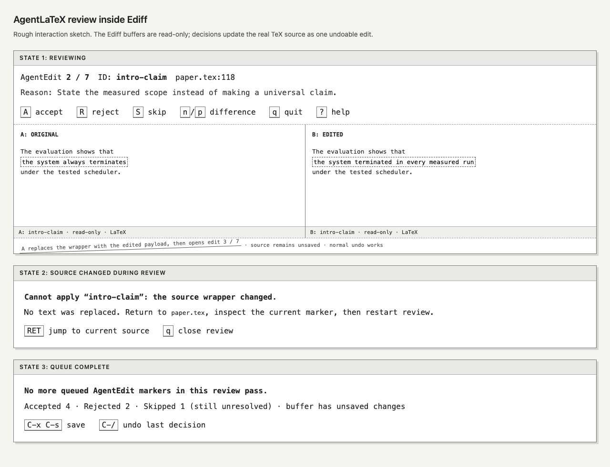

# Design: Keyboard-first AgentLaTeX review in Emacs Ediff

Generated by /office-hours on 2026-08-24
Branch: main
Repo: chughtapan/agentlatex
Status: APPROVED
Mode: Builder

## Problem Statement

AgentLaTeX makes every proposed TeX edit explicit as
`\agentedit{id}{reason}{original}{edited}`, but human acceptance still means
finding wrappers in source, comparing their third and fourth arguments, and
manually removing each wrapper. The personal-use wedge is one Emacs command
that chooses the useful review scope from editor context: the current AUCTeX
master project when available, or the current built-in TeX buffer otherwise.
It presents one marker at a time in native Ediff and turns each accept or reject
decision into one safe, undoable source edit.

## What Makes This Cool

The wrapper has already done the expensive part of a diff: it carries the exact
original, proposed replacement, reason, and stable ID. The command does not
invent another review system. It turns that structure directly into an Ediff
session where `A`, `R`, or `S` decides the current edit and immediately advances
to the next one.



The reviewing pane remains the visual reference. Its separate stale and complete
panels are superseded by the source-first terminal-state contract below: Ediff
closes, the source returns, and feedback stays in native Emacs messages.

## Constraints

- Personal and local first: one Emacs Lisp file, no server, status database,
  package registry, sidebar, or account.
- Emacs is the only editor in v0. VS Code and editor-neutral protocols are not
  part of this design.
- The AgentLaTeX wrapper remains the only source of truth. Git state and
  ordinary unmarked diffs are unrelated.
- The Codex guard and Emacs reviewer must agree on the exact `\agentedit`
  control-word boundary. The implementation also tightens the existing guard so
  it no longer accepts `\\agentedit` or longer control words as provenance.
- The real TeX source is never used as an Ediff variant. Both comparison
  buffers are read-only projections of one wrapper.
- Decisions modify the source buffer but never save it automatically.
- Decisions require undo to remain enabled in the source buffer. The command
  rejects a buffer whose `buffer-undo-list` is `t` before parsing and rechecks
  immediately before every mutation; it never enables undo on the user's behalf.
- `agentedit-review` is the only public review command. In built-in TeX modes
  it reviews the current buffer from point; in an AUCTeX-derived mode it reviews
  the complete master document from `point-min` in every source. A universal
  prefix argument (`C-u`) forces current-buffer review from point in either
  mode family. There is no public `agentedit-review-project` compatibility
  command.
- v0 requires a live, writable, widened buffer using either Emacs's built-in
  `tex-mode`/`latex-mode` family or a mode derived from AUCTeX's `TeX-mode`,
  including `LaTeX-mode` and `plain-TeX-mode`. It rejects indirect and narrowed
  buffers; an unnamed eligible buffer is supported and displayed by buffer
  name. AUCTeX is optional at runtime. Project review checks the documented
  master-document and parser APIs instead of an exact package version string.
- v0 supports Emacs 29.4 and newer. The command checks the minimum version and
  required Ediff teardown capability before parsing; the CI matrix exercises
  the oldest supported and current stable Emacs releases.
- Nested `\agentedit` calls and duplicate IDs in one pass are rejected with a
  clear location. Comments and configured verbatim contexts are ignored.

## Premises

1. Ediff already owns visual comparison, word refinement, navigation, and
   window management; AgentLaTeX should supply only parsing and decisions.
2. Accept means replace the complete wrapper with argument four; reject means
   replace it with argument three; skip leaves the wrapper unchanged.
3. Every source mutation must be atomic, independently undoable, and guarded
   by an exact wrapper snapshot so stale review buffers cannot overwrite newer
   source.
4. AgentEdit key bindings and every persistent hook must be local to its Ediff
   control buffer. A dynamically scoped startup hook is the one bootstrap
   exception; it exists only around the `ediff-buffers` call. Ordinary Ediff
   sessions must remain unchanged.
5. Session counts are ephemeral feedback, not persisted review state. Skipped
   markers remain unresolved after the pass.

## Approaches Considered

- **Ediff, then prompt:** smallest implementation, rejected because leaving
  Ediff before every decision breaks the desired review rhythm.
- **First-class AgentEdit Ediff session:** chosen; session-local commands apply
  decisions and advance without replacing Ediff's visual machinery.
- **Three-buffer Ediff merge:** rejected because a binary accept/reject choice
  does not need a third pane or hybrid merge states.

## Recommended Approach

Add `emacs/agentedit-review.el` with one public command,
`M-x agentedit-review`. The implementation has four narrow parts.

```text
M-x agentedit-review
      |
      +-- C-u supplied ----------------------> current buffer from point
      |
      +-- built-in TeX mode -----------------> current buffer from point
      |
      `-- AUCTeX-derived mode
             |
             +-- required APIs missing ------> clear user-error; never file fallback
             |
             `-- TeX-master-file t nil t
                    +-- known master --------> complete document queue
                    +-- unknown -------------> native prompt + local-variable offer
                    `-- C-g -----------------> AUCTeX semantics: current file is master
```

The public command is a small dispatcher over two private scope-specific
helpers. Route on AUCTeX mode identity, not the broader project-capability
predicate; validate the required master and parser APIs inside the project
helper so a broken AUCTeX setup cannot silently shrink to a file-only review.
Use AUCTeX's native `TeX-master-file` resolver with its `ASK` argument rather
than reproducing its `nil`, `shared`, `dwim`, persistence, or cancellation
semantics. The existing project traversal and review-session machinery remain
unchanged.

```text
live TeX buffer
      |
      v
preflight + base-buffer lock
      |
      v
linear TeX token pass ---- invalid input ----> fail before Ediff
      |
      v
ordered review records
      |
      v
one session-local Ediff pair <---- scheduled continuation ----+
      |                                                    next record
      +-- A/R --> invariant checks --> atomic source edit -----+
      +-- S -------------------------> counts only ------------+
      +-- q/error/stale ------------> shared teardown --> release lock
```

Keep a compact version of this pipeline and the legal transition table as an
inline ASCII comment beside the session transition helper in
`emacs/agentedit-review.el`. That is the only implementation location whose
control flow is non-obvious enough to justify duplicating the diagram.

Represent state with two private `cl-defstruct` types rather than anonymous
property lists. An `agentedit-review-record` owns the stable ID, reason,
payloads, live boundary markers, wrapper snapshot, and cleanup metadata for one
candidate. An `agentedit-review-session` owns the canonical source buffer,
ordered records, current pass index, decision counts, lifecycle state, pending
transition, one pending user announcement, and currently owned
Ediff/projection buffers. All mutation goes through named accessors and
transition helpers; callers do not write raw slots.

### 1. Parse a review pass

Before filtering candidates at or after point, widen temporarily and run one
lightweight TeX token pass from `point-min`. This makes opacity correct even
when review starts in the middle of a verbatim environment. The pass:

- consumes TeX control symbols and maximal control words left to right, so
  only the exact control word `\agentedit` matches. `\agentediting` and the
  text after the control symbol `\\` do not match, while a later independent
  `\agentedit` token does;
- respects TeX comments, including escaped `%`, before interpreting tokens;
- records `\verb`/`\verb*` from its delimiter through the matching delimiter
  on that line;
- when it sees an uncommented configured `\begin{environment}`, records an
  opaque range through a line-oriented terminator: optional indentation, the
  exact `\end{environment}`, optional horizontal whitespace or a TeX comment,
  then newline or end of buffer. An `\end{environment}` embedded mid-line in
  verbatim content is ordinary opaque text. Content inside the environment is
  never tokenized, and an unterminated configured environment aborts the pass
  before Ediff opens;
- handles starred environment names through exact entries in the configured
  list. Unknown custom verbatim environments are supported by adding their
  names to that list.

Then consider exact `\agentedit` control-word tokens outside the recorded opaque
ranges and at or after the original point. For each candidate:

- require an initialized `tex-mode`/`latex-mode` syntax table and use Emacs
  syntax state from the active built-in TeX or AUCTeX mode to ignore comments,
  including escaped `%` cases;
- treat the precomputed `\verb`/`\verb*` spans and environments in
  `agentedit-review-verbatim-environments` as opaque. The default list is
  `verbatim`, `verbatim*`, `Verbatim`, `Verbatim*`, `lstlisting`, and `minted`;
  users may add project-specific verbatim environments;
- parse exactly four balanced brace arguments with `scan-sexps`, preserving
  the characters inside each outer brace;
- require ID and reason to be non-empty both raw and after one-line display
  normalization, while allowing an empty original for an addition or an empty
  edited payload for a deletion;
- reject malformed or nested markers and duplicate IDs with the ID and source
  position;
- store start/end markers, the complete wrapper snapshot, and all four
  payloads in a session record.

Keep the parser linear in source size plus the number of candidates. Produce
opaque ranges and candidate positions in source order, then classify candidates
with one monotonic range cursor; never restart a range search for each marker.
The command is a fresh one-shot scan, so v0 adds no persistent index, cache, or
invalidation machinery. Its retained memory remains proportional to the marker
records and their captured wrapper/payload text, not to extra copies of the
entire source buffer.

The Python guard remains a separate, deliberately shallow proposed-write check,
but its token-boundary cases must match the reviewer's TeX token cases. Keep
parallel regression cases in the Python and ERT suites for one backslash, two
backslashes, a longer control word, and a valid independent token after a control
symbol. The parsers need not share an implementation or accept identical input
contexts beyond this provenance boundary.

Define `agentedit-review-verbatim-environments` as a typed `defcustom` under an
`agentedit-review` customization group. Before scanning, require a proper list
whose entries are nonempty strings; reject invalid configuration with a
`user-error` before creating records or temporary buffers.

The pass order is source order at session start. Markers keep later positions
valid as earlier wrappers shrink or grow. Start markers advance past text
inserted exactly at their boundary; end markers stay before text inserted at
theirs, so unrelated boundary insertions remain outside the guarded snapshot.
The location shown for a record is recalculated from its live start marker when
it opens. The displayed `N / M` is pass position, not a claim about the number
that will remain unresolved. Temporary buffer names use a sanitized,
length-limited ID plus a unique suffix; the full ID remains in metadata.

### 2. Open a session-local Ediff view

For the current record, create two read-only temporary buffers named from the
stable ID. Buffer A contains the original payload and buffer B the edited
payload. Start `ediff-buffers`, then configure only its control buffer:

- show pass position, stable ID, source file and line, and reason;
- bind `A` to accept, `R` to reject, and `S` to skip;
- retain Ediff's ordinary navigation, scrolling, help, and quit, while ensuring
  automatic word refinement is on for this session;
- use a copied local keymap and buffer-local hooks so global Ediff behavior is
  untouched.

Do not set `ediff-split-window-function`. Honor the user's configured side-by-
side or stacked layout and leave Ediff's normal `|` split toggle available. The
reviewing-state contract and tests must work in both orientations; the
wireframe illustrates one wide-frame arrangement, not a forced breakpoint or
window policy.

Each projection also receives a buffer-local `kill-buffer-hook`. If A or B is
killed outside AgentEdit's own guarded cleanup, the hook marks the pass
`failed`, schedules nonprompting teardown from the live control buffer, makes no
source mutation, and releases the lock through the shared resource-release
function. A cleanup-in-progress guard makes killing the sibling projection
idempotent and prevents recursive failure handling. If startup has not produced
a live control buffer yet, the same hook releases only resources AgentEdit owns.

Use two native, control-buffer-local lines with a fixed priority order instead
of pretending `header-line-format` can hold the wireframe's multi-line block:

1. The header line shows `AgentEdit N / M`, stable ID, source file and live line,
   then `Reason:` using the remaining width. On a narrow frame, elide source
   location before ID, pass position, or reason.
2. The mode line shows `A accept`, `R reject`, `S skip`, `q quit`, cumulative
   accepted/rejected/skipped counts, and whether the source is unchanged or
   unsaved. On narrow frames, preserve controls, then counts, then source status.
   Keep textual labels even when faces or colors are customized.

Each projection has a persistent textual header: `− ORIGINAL · reject keeps
this` for buffer A and `+ PROPOSED · accept keeps this` for buffer B. The
current original hunk receives a quiet red tint and the proposed hunk a quiet
green tint. Fine-grained original changes use stronger red plus strike-through;
fine-grained proposed changes use stronger green plus underline. A display-only
`−` or `+` marker precedes the current hunk. These redundant text, color, and
decoration channels keep additions, deletions, and rewrites distinguishable.
Select and refine the first difference during AgentEdit startup so the initial
review frame already displays this hierarchy without requiring `n` first.

Implement this through buffer-local face remapping from Ediff's standard A/B
faces to six AgentEdit faces. Install the hunk signs as `before-string`
properties on Ediff's current-difference overlays, which already move with
navigation. Provide explicit dark, light, 16-color, and monochrome face specs.
Projection-buffer teardown removes all remapping and headers automatically;
ordinary Ediff buffers and global theme faces remain unchanged.

Keep record metadata raw and exact; normalize only its one-line presentation
through one pure helper. The helper replaces newlines, tabs, and other control
characters with spaces, collapses whitespace runs, and trims the result while
preserving printable Unicode and literal percent signs. Header- and mode-line
constructs reference buffer-local symbols whose string values Emacs displays
verbatim, so user metadata cannot become a `%` construct. Static labels may use
the standard faces above, but metadata values remain ordinary literal strings.
Every minibuffer and confirmation message uses a fixed format string with
metadata supplied only through `%s` arguments; metadata is never itself a
format string. “Complete reason” means the entire normalized reason without
width truncation in the announcement, while the session record retains the
byte-for-byte original value for provenance and decisions.

Compute the normalized ID, reason, source label, and live-marker location once
when each record opens, then store those presentation strings in the current
control buffer. Redisplay may read the current control-window width, session
counts, and source `buffer-modified-p`, but it never renormalizes raw metadata,
rescans source text for a line number, or walks beyond the visible truncation
width. Resizing the control window or toggling `|` therefore recomposes the
priority groups from the same snapshot, while counts and dirty state stay live.
Discard the snapshot with that record; this is bounded presentation state, not
a persistent cache or an invalidation subsystem.

Every AgentEdit decision command has a precise docstring that names the source
effect, undo behavior, and absence of autosave, so `C-h k` on `A`, `R`, `S`, or
`q` is a complete accessible explanation. Keep Ediff's `?` help path unchanged.
Do not require a mouse, tooltip, animation, glyph, or face distinction to learn
or operate the review flow.

When the first record opens, echo its complete reason, source location, and
`A accept, R reject, S skip, q quit` once in the minibuffer. This is both the
truncation fallback and the spoken entry contract. After a decision, combine
acknowledgment with the next record, for example:
`Accepted intro-claim · Next 3 / 7 methods-scope · Reason: ...`. Update counts
before this message and never add a delay, flash, bell, or per-decision
confirmation. The pass-level session owns exactly one pending announcement
across the control-buffer teardown/startup gap. Cleanup records the completed
action but does not echo the transition. After the next startup hook has
installed AgentEdit's controls and moved the session to `reviewing`, it emits
and clears that announcement exactly once. The initial record uses the same
post-startup emitter without a completed-action prefix. If startup fails, the
terminal failure message replaces and clears the pending announcement rather
than reporting a next record that never opened. AgentEdit does not rewrite
Ediff's generated help text. The source buffer, session record, and temporary
buffers belong to that control buffer.
Session ownership is keyed by `(or (buffer-base-buffer) source-buffer)` even
though v0 rejects indirect entry buffers, so a second view cannot bypass the
lock. The registry stores the pass-level session object, not a control buffer.
It acquires the lock before parsing and retains it across every successful
per-record teardown and scheduled continuation. Only terminal `finished`,
`aborting`, `stale`, compatibility failure, or abnormal failure releases it.

Install a dynamically scoped `ediff-startup-hook` before calling
`ediff-buffers`. The startup function captures the new control buffer, installs
its copied local keymap, header line, buffer-local `ediff-cleanup-hook`, and a
buffer-local `kill-buffer-hook` fallback, then moves the session from
`starting` to `reviewing` and invokes the single announcement emitter. The
emitter runs only after successful startup, consumes at most one session-owned
announcement, and never schedules lifecycle work. AgentEdit does not restore
windows independently during normal operation; Ediff owns its window or
control-frame cleanup.

### 3. Apply one decision safely

Accept and reject perform the same guarded transition with a different
payload:

1. Confirm the source buffer is live and writable, remains widened, and has undo
   enabled.
2. Confirm the text between the record's markers exactly equals the captured
   wrapper snapshot.
3. Add an undo boundary, replace that range inside `atomic-change-group`, then
   add a second boundary. One decision is therefore isolated from edits made
   immediately before review and from the next decision.
4. Update the accepted or rejected session count.
5. Quit the current Ediff session without prompting, clean its temporary
   buffers, and open the next queued record.

Wrap the atomic replacement in a `condition-case`. If any source mutation
signals, rely on `atomic-change-group` to roll back the attempted change, leave
all decision counts unchanged, transition to `failed`, tear down Ediff, release
the pass lock, and report that no decision was applied together with the
original Emacs error. This covers read-only text properties, modification hooks,
and unexpected internal replacement failures even when the buffer as a whole is
writable.

If the snapshot differs, make no change. Transition to `stale`, abort the pass,
let Ediff clean up, and report the partial counts. A zero-delay post-cleanup
callback automatically selects the source and jumps to the marker when both are
still live. It never reads or reinserts keyboard input. A dead source or marker
produces a clear message instead. The user must restart review after inspecting
the source.
Skip closes the current Ediff view, increments the skipped count, leaves the
wrapper intact, and advances. AgentEdit's control-buffer-local `q` uses
`y-or-n-p` with live values in this semantic contract: `Stop review? 2
accepted, 1 rejected, 0 skipped stay applied; current and 4 unvisited markers
stay unchanged (y or n)`. Declining leaves the state as `reviewing` on the same
record with no cleanup or source effect; confirming moves to `aborting`, uses
the same teardown adapter, and reports accepted, rejected, skipped, and
unvisited counts without applying a decision to the current marker.

### 4. Finish and clean up

The session state machine is `starting`, `reviewing`, `deciding`, `aborting`,
`stale`, `partial-failure`, `failed`, and `finished`. Every state write goes
through one transition helper, which rejects an edge not listed below without
running decision or cleanup effects:

```text
starting  -> reviewing | finished | failed
reviewing -> deciding | aborting | failed
deciding  -> reviewing | finished | stale | partial-failure | failed

terminal: aborting | stale | partial-failure | failed | finished
```

`finished` from `starting` is the no-marker result. `failed` covers unsupported
runtime compatibility after session allocation, Ediff startup errors, killed
ownership or projection buffers, undo becoming disabled, the source becoming
narrowed, atomic source-mutation errors, and other abnormal failures before a
successful mutation;
`partial-failure` remains reserved for teardown failure after mutation. Terminal
states have no outgoing edges. Repeated decision commands outside `reviewing`
fail before checking snapshots or changing source. An `A`, `R`, or `S` command
enters `deciding`, records
the requested transition, and calls a single version-coupling adapter,
`agentedit-review--ediff-really-quit`. On the supported Emacs releases the
adapter invokes `ediff-really-quit` from the control buffer, bypassing
`ediff-quit`'s confirmation. Availability is checked before the pass starts and
again immediately before any decision mutates source. The initial check also
enforces the Emacs 29.4 minimum, so an unsupported version fails before parsing
or opening Ediff; either compatibility failure therefore precedes mutation.
This is the only Ediff internal API used and has a focused compatibility test.

The control-buffer-local `ediff-cleanup-hook` is primary: it kills the two
read-only projection buffers, records per-record cleanup as complete, reports
counts when terminal, and schedules either the next record or the stale jump
callback after control-buffer teardown. For a successful continuing decision,
it leaves the session-owned pending announcement untouched for the next
startup hook; it never echoes that transition from the dying control buffer.
It retains the pass lock when a successful decision schedules another record
and releases it only on a terminal state. Because the projections are gone
before Ediff's janitor runs, teardown
never prompts about keeping them. The control buffer's `kill-buffer-hook` is an
idempotent fallback that, on abnormal termination, transitions the pass to
terminal failure and releases the lock. Both hooks call one private idempotent
resource-release function that owns projection-buffer disposal and terminal
lock release. The normal cleanup hook alone owns count reporting and scheduling;
the fallback never advances. This ordering prevents duplicated ownership logic,
recursive quit hooks, double application, and another session entering the
scheduled-continuation gap.

The source replacement and accepted/rejected count occur before teardown. If
`ediff-really-quit` unexpectedly fails after that successful mutation, a
`condition-case` plus `unwind-protect` transitions to terminal
`partial-failure`, runs fallback cleanup, releases the pass lock, and does not
advance. The report states that the named decision was applied, the source is
unsaved and normally undoable, and Ediff teardown failed. It never describes
that state as a rollback.

After the last queued record, let Ediff restore its own windows and report
accepted, rejected, and skipped counts plus whether the source buffer has
unsaved changes. On abnormal failure before Ediff owns a control buffer,
AgentEdit kills only the temporary buffers it created. On failure after startup
or on user quit, Ediff owns window cleanup while AgentEdit removes session-local
state and reports partial counts. Cleanup is idempotent.

## Interaction States

1. **Reviewing:** metadata and `A`, `R`, `S`, `q` appear in the control-buffer
   header-line legend; original and edited payloads follow the user's current
   Ediff split; ordinary Ediff keys, including `|` to toggle layout, remain
   available through Ediff's normal help.
2. **Stale source:** no replacement; abort the pass, report partial counts,
   clean up Ediff, then automatically select and recenter on the marker's live
   location when available.
3. **Pass complete:** report counts and unsaved state. If any edits were
   skipped, say explicitly that they remain unresolved.
4. **Pass aborted:** report decisions already applied plus skipped and unvisited
   counts; preserve all undecided wrappers.
5. **No markers from point:** leave the buffer and windows unchanged and show a
   short message.
6. **Malformed or unsupported marker:** identify its line and stop before
   opening Ediff or changing source.

### Visible-state contract

Terminal states never open an AgentEdit summary buffer. They restore the source
window and use a consistent echo-area message that remains until the user's next
command. When a live source location is relevant, select it and recenter before
showing the message.

| State | What the user sees | Primary next step |
| --- | --- | --- |
| Starting | `Scanning AgentEdit markers from point...` before the full-buffer token pass; source and windows otherwise unchanged | Wait for the first Ediff pair or a preflight result |
| Empty | Source remains selected; `No AgentEdit markers at or after point.` | Continue editing |
| Reviewing | Two read-only payloads, prioritized header metadata, textual action legend, pass position, and source dirty state | Press `A`, `R`, `S`, navigate, ask for Ediff help, or quit |
| Stale | Ediff closes; source selects and recenters on the live wrapper; `Review stopped at ID: source changed. No decision applied. A accepted, R rejected, S skipped. Inspect this marker and restart.` | Inspect the wrapper, then run review again |
| Failed before mutation | Ediff closes and source returns when live; `Review failed before applying ID: ERROR. No decision applied. A accepted, R rejected, S skipped.` | Correct the named condition and restart |
| Partial failure after mutation | Source selects the applied edit; `DECISION applied to ID. Source is unsaved and undoable, but Ediff cleanup failed: ERROR. Review stopped.` | Save, undo, or inspect the applied source edit |
| Aborted | Source returns; `Review stopped: A accepted, R rejected, S skipped, U unvisited. Current and unvisited markers are unchanged.` | Resume later from the desired point |
| Finished | Source returns; `Review complete: A accepted, R rejected, S skipped. Source is unchanged/unsaved; skipped markers remain unresolved.` | Save, undo, or continue editing in the source buffer |

Counts use words and letters rather than color or icons, and every error names
whether the current decision was applied. The implementation may format values,
but it must preserve the state, counts, source status, and next-action meaning.

### User journey storyboard

| Step | User does | Intended feeling | Visible support |
| --- | --- | --- | --- |
| 1. Start | Runs `M-x agentedit-review` at the desired point | Oriented, still in control of scope | Brief scanning message; source and windows do not change until a valid record opens |
| 2. Understand | Scans ID, location, reason, and both payloads | Confident about what is being proposed and why | Identity/reason first, read-only labels, native Ediff refinement and navigation |
| 3. Decide | Presses `A`, `R`, or `S` | Fast but not reckless | Atomic source rule, no autosave, textual controls, cumulative counts |
| 4. Continue | Sees the next record immediately | Certain the prior key registered | Combined `Accepted/Rejected/Skipped ID · Next N / M · Reason` message |
| 5. Recover | Encounters stale source or another failure | Safe, never wondering whether text changed | Source-first return, recentered wrapper when live, and explicit applied/not-applied wording |
| 6. Finish | Returns to the source after the queue | Done, with clear ownership of saving | Final counts, skipped/unvisited reminder, unchanged/unsaved status, normal Emacs save and undo |

The five-second impression is a familiar Ediff view with a clear decision. The
five-minute experience is an uninterrupted, acknowledged review pass. Long-term
trust comes from the source remaining unsaved, every mutation being undoable,
and every abnormal exit stating whether a decision was applied.

## Design Review Decisions

| Dimension | Before | After | Decision that closed the gap |
| --- | ---: | ---: | --- |
| Information architecture | 7/10 | 10/10 | Split identity/reason and controls/status across prioritized native header and mode lines |
| Interaction states | 7/10 | 10/10 | Restore the TeX source for every terminal state and specify exact visible messages |
| User journey | 8/10 | 10/10 | Acknowledge each decision through counts and combined prior-action/next-record copy without pausing |
| Design specificity | 10/10 | 10/10 | Keep native Ediff and reject custom dashboard, decoration, or motion patterns |
| Design-system alignment | 8/10 | 10/10 | Integrate through Ediff's standard faces, with projection-local AgentEdit remaps that remain legible under the active theme |
| Responsive and accessibility | 7/10 | 10/10 | Honor the user's Ediff split, preserve the `|` toggle, and expose actions through spoken messages and command help |
| Unresolved decisions | 1 open | 0 open | Use one exact native quit confirmation with live applied and unchanged counts |

The overall design score moved from 7/10 to 10/10. Seven design decisions were
added. No product behavior was deferred. The gstack designer could not generate
new variants because no OpenAI API key was configured; the user chose not to
turn regeneration into backlog work because the reviewing pane plus the exact
state contract are sufficient implementation references.

## Focused Engineering Delta Review

The post-design engineering rerun reviewed only the visual and interaction
delta against the previously cleared parser, mutation, lock, and Ediff-lifecycle
architecture. Scope remains accepted as-is: this is still one repository-local
Lisp module that reuses native Ediff, the existing Python guard, and the existing
CI workflow.

| Section | Finding | Decision |
| --- | --- | --- |
| Architecture | A decision acknowledgment crosses the teardown/startup gap between two control buffers | The pass-level session owns one pending announcement; successful next startup consumes it exactly once, while startup failure replaces it with terminal copy |
| Code quality | Raw ID, reason, and source text can contain mode-line `%` constructs or control whitespace | One pure normalizer feeds buffer-local literal symbols and fixed-format `%s` messages while raw provenance remains unchanged |
| Tests | Visual, spoken, and lifecycle branches were traced through the updated coverage diagram and failure matrix | Zero uncovered design-delta paths; the QA artifact is `tapanc-main-eng-review-test-plan-20260825-124245.md` |
| Performance | Adaptive presentation could repeat normalization or source line scans during redisplay | Snapshot presentation metadata/location once per record; keep redisplay width-bounded with only counts and dirty state live |

All three recommendations selected the complete option (Lake Score 3/3). No
new TODO was proposed: the only deferred product direction, a cross-editor
adapter, is already recorded in `TODOS.md`. No failure mode is silent and
untested, no prior design decision was reopened, and no unresolved decision
remains. The independent nested Codex pass was skipped because this review was
already running under Codex.

## Primary Command Router Engineering Review

The router follow-up changes only command dispatch, AUCTeX master resolution,
tests, and user documentation. It does not redesign parsing, Ediff lifecycle,
project traversal, mutation, or locking.

| Section | Finding | Decision |
| --- | --- | --- |
| Architecture | Separate file and project commands make users choose scope manually | Make `agentedit-review` the only public router: AUCTeX defaults to project, built-in TeX defaults to file, and `C-u` forces file |
| Architecture | A public compatibility alias would preserve an API the personal config no longer needs | Remove `agentedit-review-project`; keep the project engine private |
| Architecture | An unresolved AUCTeX master needs project context before scanning | Call `TeX-master-file` with `ASK` so AUCTeX prompts before project traversal |
| Architecture | A master selected for review should remain consistent with later AUCTeX compilation | Preserve AUCTeX's native file-local `TeX-master` persistence behavior |
| Architecture | AUCTeX maps cancellation to “this file is master” | Preserve that native behavior instead of duplicating prompt logic |
| Code quality | `agentedit-review--auctex-project-capable-p` combines mode identity and API availability | Route on `agentedit-review--auctex-mode-p`, then fail clearly inside the project path when required APIs are missing |
| Tests | Existing AUCTeX tests call the main command under its former file-only semantics | Add forced-file regressions, unit coverage for every dispatcher branch, and one real AUCTeX master-resolution/persistence integration case |
| Performance | The router adds one mode check and one prefix check | No issue; project scanning retains its existing once-per-source behavior |

Five of seven recommendations selected the proposed complete option (Lake
Score 5/7). The two departures deliberately removed compatibility surface and
preferred an AUCTeX prompt over immediate failure. There are no unresolved
decisions, no new TODO proposal, and no silent failure mode left without a test
or clear error. The nested outside-voice pass was skipped because this review
was already running under Codex.

## Success Criteria

- In a built-in TeX buffer, `M-x agentedit-review` opens the first valid marker
  at or after point and shows its ID, reason, location, original, edited text,
  and pass position.
- In an AUCTeX-derived buffer, `M-x agentedit-review` resolves the native master
  and reviews all reachable sources in document order; `C-u M-x
  agentedit-review` instead reviews only the current buffer from point.
- Missing AUCTeX project APIs fail clearly rather than silently routing to a
  file review. An unknown master uses AUCTeX's native prompt, persistence offer,
  and cancellation-as-current-file behavior.
- Additions, deletions, multiline arguments, nested ordinary braces, escaped
  braces, whitespace between arguments, and markers after comments parse
  without changing payload text.
- Commands inside TeX comments, `\verb`, and the configured standard verbatim
  environments are ignored. Malformed, nested, and duplicate AgentEdit
  wrappers fail before mutation with an actionable location.
- `A` leaves only the edited payload; `R` leaves only the original payload;
  `S` leaves the exact wrapper. Each accept or reject is one source-buffer undo
  operation and does not save the file.
- A changed wrapper snapshot, killed source buffer, read-only source buffer,
  indirect/narrowed entry buffer, or overlapping session cannot lose source
  text.
- `q`, errors, and normal completion restore windows and remove temporary
  buffers without changing global Ediff hooks or bindings.
- Line numbers follow live markers, adjacent wrappers remain independently
  guarded, and insertions exactly at wrapper boundaries remain outside the
  captured wrapper.
- A real pass over at least three representative markers can be completed
  without leaving Ediff or manually editing a wrapper.

## Verification Plan

Add batch ERT tests beside the Lisp file or under `tests/emacs/`:

- router cases proving built-in TeX selects the current-buffer helper, AUCTeX
  selects the project helper, `C-u` forces the current-buffer helper under
  AUCTeX, and an AUCTeX buffer with missing project APIs reports a clear error
  without calling either scan path;
- **critical regression tests** updating existing AUCTeX calls that require
  file scope to pass the prefix argument, while preserving the built-in command
  behavior from point;
- one real AUCTeX 14.1.0 integration case that begins without a resolved
  `TeX-master`, exercises native master selection and the local-variable offer,
  then proves the resulting document queue is reviewed in source order; cover
  native cancellation separately and assert that the current file is used as
  its own master;
- parser cases for additions, deletions, multiline/nested braces, escaped `%`,
  comments, whitespace, `\verb`, every default verbatim environment, a custom
  configured verbatim environment, empty required fields, malformed braces,
  nested markers, duplicate IDs, exact control-word boundaries
  (`\agentediting`, `\\agentedit`, and a valid token after a control symbol),
  starting inside every opaque context, unterminated opaque contexts, and
  sanitized temporary-buffer names;
- review-origin boundary cases with point immediately before and exactly at a
  control word, inside each of the four arguments, immediately after a wrapper,
  and between wrappers. Preserve the current contract: only a control word at or
  after the original point is a candidate, so a wrapper containing point is
  skipped, and malformed or duplicate markers wholly before point do not poison
  the pass;
- matching Python-guard and ERT regression cases proving that a genuine
  `\agentedit` control word is accepted while `\\agentedit` and longer control
  words are not, and that a later independent token remains detectable;
- customization cases for the default list, one valid project-specific
  environment, and non-list, non-string, or empty-string entries failing before
  parsing;
- run the parser, eligibility, comment, and escaped-character cases under
  built-in `latex-mode` and AUCTeX `LaTeX-mode` across the supported CI matrix;
  AUCTeX is a test dependency, not a required runtime dependency for
  built-in-mode users;
- mutation cases for accept, reject, skip, exact-text preservation, one-step
  undo after preexisting edits and after two consecutive decisions, stale
  snapshots, adjacent wrappers, boundary insertions, killed/read-only buffers,
  live line numbers, and no autosave;
- mutation-failure cases using a read-only text property and an injected
  replacement error. Both must preserve the exact wrapper, leave counts
  unchanged, report that no decision was applied, clean up Ediff, and release
  the pass lock;
- eligibility and mutation cases proving undo-disabled buffers fail before
  parsing, undo becoming disabled during Ediff fails before mutation, and the
  command never calls `buffer-enable-undo` or changes the user's undo setting;
- a mutation case that narrows the source after Ediff opens and proves the pass
  aborts before guarded-range access or mutation, preserves the restriction, and
  reports that the user must widen and restart;
- stale-source integration cases that verify automatic return to a live marker
  after Ediff cleanup, no keyboard event is consumed or added to
  `unread-command-events`, and dead-source or dead-marker cases report clearly
  without attempting a selection;
- lifecycle cases for local keymaps, cleanup after `q` and errors, idempotent
  cleanup, every allowed state transition, every rejected edge, repeated
  decision commands, complete and partial-pass counts, no-match
  behavior, eligibility errors, and overlapping-session rejection by base
  buffer. Tests cover declining and confirming `q`, nonprompting decisions,
  pass-lock ownership during the scheduled-continuation gap, primary cleanup,
  the abnormal kill-buffer fallback, compatibility failure before mutation,
  and partial failure after an applied decision;
- quit-copy cases that verify live counts and the applied/unchanged distinction,
  declining on the same record with no cleanup or source effect, and confirming
  with the standard aborted summary;
- display-safety cases containing literal `%`, `%b`, newlines, tabs, control
  characters, and long printable Unicode in IDs, reasons, and source names.
  Assert that one normalization helper feeds all one-line surfaces,
  whitespace-only required metadata fails before Ediff, mode/header-line values
  remain literal, announcements use fixed format strings, and raw record
  metadata is unchanged;
- redisplay-cost cases instrument normalization and live-line calculation to
  prove each runs once per opened record, then resize the control window and
  toggle `|` repeatedly to prove the formatter reads live width/count/dirty
  values, preserves priority order, and never scans beyond visible truncation
  width;
- announcement-handoff cases that verify the initial announcement occurs after
  successful startup, a decision stores exactly one combined acknowledgment
  and next-record announcement across cleanup, the next startup emits and
  clears it once, repeated cleanup cannot duplicate it, and startup failure
  clears it in favor of the terminal failure message;
- a batch integration smoke test that pins
  `ediff-window-setup-function` to the plain-window implementation, waits for
  the startup hook deterministically, enters an AgentEdit control buffer,
  executes `A`, `R`, and `S`, and verifies source, cleanup, and next-record
  transitions using the installed system `diff`;
- integration cases that kill projection A and projection B separately during
  review and prove each path applies no decision, reports failure, tears down the
  control buffer, kills the surviving projection without recursion, and releases
  the pass lock;
- a local performance fixture containing a 1 MiB TeX buffer with many opaque
  ranges and markers. Record the end-to-end parse time and confirm, by
  instrumentation, that the range cursor only moves forward. Keep timing out of
  CI assertions because shared-runner latency is not a product contract;
- one manual GUI smoke test with the user's default Ediff window/control-frame
  setup to verify that AgentEdit does not fight Ediff's restoration.
- orientation and narrow-frame cases that run the reviewing contract with both
  horizontal and vertical Ediff splits, preserve the `|` toggle, and verify the
  header/mode-line elision priorities without changing the user's configured
  split function;
- one manual screen-reader smoke test using an available spoken-Emacs setup:
  enter a record, hear the full reason and action legend, use `C-h k` on every
  AgentEdit decision key, make one decision, and hear the acknowledged next
  record without depending on a face or glyph.

Run in batch mode locally and in CI with Emacs 29.4 and 30.2. Exercise built-in
TeX plus properly installed AUCTeX 14.1.0 and 14.1.2. Test that Emacs releases
below 29.4 are rejected before parsing or opening Ediff.
Update the Python guard tests for the tightened token boundary; all unrelated
Python and LaTeX tests must continue to pass.

### Planned coverage diagram

```text
CODE PATHS                                      USER FLOWS
agentedit-review(prefix)                        Start from a TeX buffer
├─ built-in TeX -> buffer helper [ERT]          ├─ built-in: review from point
├─ AUCTeX + C-u -> buffer helper [ERT]          ├─ AUCTeX: review whole document
└─ AUCTeX, no prefix -> project helper [ERT]    ├─ C-u: intentionally review this file
   ├─ missing APIs -> clear error [ERT]          └─ unknown master: native prompt/offer
   └─ TeX-master-file t nil t [AUCTeX integ]
      ├─ known master -> document queue
      ├─ unknown -> prompt + persist
      └─ C-g -> current file is master

private buffer/project helpers                  Existing review flow
├─ preflight [ERT]                              ├─ no markers -> message, no windows
│  ├─ Emacs >=29.4 / reject older releases     ├─ invalid input -> located error
│  ├─ built-in TeX / AUCTeX 14.1 / reject      └─ first eligible marker -> Ediff
│  ├─ direct + widened + writable + undo on
│  ├─ valid/invalid verbatim configuration      Review one marker [integration]
│  └─ pass lock free/busy                       ├─ A -> edited payload + one undo
├─ token and marker pass [ERT in both modes]    ├─ R -> original payload + one undo
│  ├─ comments/control symbols/control words    ├─ S -> wrapper unchanged
│  ├─ verb/standard/custom environments         └─ q decline / q confirm
│  ├─ four balanced arguments + empty payloads
│  ├─ malformed/nested/duplicate -> fail        Source changes during Ediff
│  └─ point boundary matrix                     ├─ wrapper differs -> stale + jump
├─ open Ediff [integration]                     ├─ killed/read-only/narrowed -> fail
│  ├─ startup + local keymap/header/hooks       ├─ undo disabled -> fail
│  └─ startup error -> owned-resource cleanup   └─ replacement error -> rollback
├─ render review UI [ERT + integration]         Visual and spoken review
│  ├─ literal-safe metadata normalization       ├─ full first-record announcement
│  ├─ bounded header/mode-line formatter        ├─ narrow fallback without lost meaning
│  ├─ standard faces + textual controls         ├─ horizontal/vertical split + `|`
│  └─ one pending announcement handoff          └─ decision acknowledged once, then next
├─ guarded decision [ERT + integration]
│  ├─ live/writable/widened/undo rechecks       Abnormal Ediff lifecycle
│  ├─ exact snapshot match/stale                ├─ projection A/B killed -> fail
│  ├─ accept/reject atomic success/error        ├─ control killed -> fallback cleanup
│  └─ skip and repeated-command rejection       ├─ teardown fails after mutation
└─ teardown [integration]                       │  -> partial success, never advance
   ├─ primary/fallback idempotence              └─ next record / final counts + unsaved
   ├─ projection cleanup without recursion
   ├─ pass lock retained/released at right edge Manual GUI smoke
   └─ next record / stale jump / final report   └─ user's Ediff window restoration
```

Every listed branch has a planned ERT, batch Ediff integration, or manual GUI
verification. The established parser and Ediff paths are implemented; the five
new router/master paths remain explicit implementation requirements rather than
unresolved test-plan gaps.

### Failure-mode matrix

| Codepath | Realistic failure | Planned test | Handling | User-visible result |
| --- | --- | --- | --- | --- |
| Scope router | AUCTeX is misdetected, `C-u` is ignored, or missing APIs silently fall back to one file | Dispatcher ERT plus real AUCTeX master-resolution integration | Route on mode identity; validate APIs in the project helper; native master resolver owns prompting | Intended scope is explicit; configuration failures are clear |
| Preflight | Unsupported Emacs/AUCTeX, invalid buffer/config, disabled undo, or busy lock | ERT for every accepted/rejected branch | Fail before parsing or temporary buffers | Clear `user-error`; source and windows unchanged |
| Token pass | Unterminated opaque range or malformed/nested/duplicate marker | Parser ERT under both mode families | Abort before Ediff and release lock | Exact line, ID when available, and reason |
| Ediff startup | `diff` or Ediff startup signals before a control buffer exists | Batch startup-failure injection | Kill only AgentEdit-owned projections and release lock | Clear startup failure; source unchanged |
| Metadata rendering | An ID, reason, or source name contains `%` constructs, line breaks, control characters, or enough text to make redisplay expensive | ERT across every display surface plus instrumented resize/toggle redisplay | Once-per-record normalization/location snapshot; buffer-local literal symbols; fixed message formats; width-bounded formatter | Literal, responsive metadata with raw provenance unchanged |
| Announcement handoff | Teardown or next-record startup overwrites, duplicates, or strands a decision acknowledgment | Batch integration across cleanup, next startup, repeated cleanup, and startup failure | One session-owned pending announcement consumed only after successful startup; terminal failure replaces it | One acknowledged next record, or one truthful terminal failure |
| Projection lifecycle | Projection A or B is killed manually | Batch integration for A and B | Guarded failure teardown; kill sibling once; release lock | Pass failed with partial counts; no decision applied |
| Decision precheck | Source dies, becomes read-only/narrowed, disables undo, or changes wrapper text | ERT/integration for each invariant | No mutation; terminal `failed` or `stale`; normal cleanup | Actionable abort; stale case returns to live marker |
| Atomic mutation | Read-only text property, modification hook, or replacement helper signals | ERT with text property and injected error | Atomic rollback, unchanged counts, terminal failure, cleanup | Explicitly says no decision was applied |
| Post-mutation teardown | Internal Ediff quit signals after a successful replacement | Injected integration failure | `partial-failure`, cleanup, lock release, never advance | Names applied decision, unsaved/undoable state, and teardown error |
| Normal cleanup | Cleanup runs twice or during scheduled continuation | Idempotence and lock-gap integration tests | Shared release primitive; only primary hook schedules | Correct next record or final counts; no prompt/leak |
| Stale return | Source or marker dies before post-cleanup jump | Integration cases for live/dead combinations | Never reads input; jump only when both live | Automatic inspection jump or clear dead-object message |

No failure mode is both silent and missing test/error handling; the critical-gap
count after this review is zero.

## What already exists

- `latex/agentedit.sty` and its packaged copy already define the four-argument
  `\agentedit` provenance wrapper. The reviewer reuses that contract rather than
  introducing a second on-disk format.
- `plugins/agentedit-guard/scripts/guard_agent_edits.py` already detects proposed
  writes that remove wrappers. It remains a deliberately shallow write guard;
  this plan only tightens its TeX control-word boundary and shares regression
  cases, not parser code.
- `tests/test_guard_agent_edits.py` and `tests/test_distribution_layout.py`
  already provide Python regression and packaging checks. They stay in place
  and the new ERT suite covers the Emacs-specific parser and lifecycle.
- `.github/workflows/ci.yml` already runs the repository's Python and LaTeX
  checks. The plan extends it with one pinned Emacs/AUCTeX batch job instead of
  creating a separate CI system.
- Emacs Ediff already owns comparison rendering, navigation, and window
  restoration. AgentEdit supplies session-local decisions and cleanup without
  rebuilding a diff UI.
- `agentedit-review` and `agentedit-review-project` already implement the two
  review engines. The router refactors their bodies into private helpers and
  reuses them; it does not rebuild scanning or session behavior.
- `agentedit-review--auctex-mode-p`, the project-capability check,
  `TeX-master-file`, and the recursive AUCTeX input traversal already expose
  every signal the router needs. The change separates detection from validation
  and delegates master prompting back to AUCTeX.
- The repository has no `DESIGN.md`; for this native editor feature, Ediff's
  standard A/B faces remain the integration surface. AgentEdit remaps those
  faces only in its temporary projections because the user's active theme made
  whole-hunk and fine-diff faces visually identical.
- `docs/designs/agentlatex-ediff-review-wireframe.png` remains useful for the
  wide-frame reviewing composition. Its terminal panels are explicitly
  superseded by the source-first visible-state contract, so implementation must
  not treat those two panels as approved screens.

## NOT in scope

- A VS Code adapter or editor-neutral protocol is deferred until the Emacs
  workflow demonstrates repeated use; the follow-up is recorded in `TODOS.md`.
- MELPA packaging and release automation are explicitly declined for v0 because
  repository-local loading satisfies the personal-use goal.
- A public `agentedit-review-project` compatibility alias is intentionally not
  retained; this personal configuration has no compatibility requirement and
  one obvious entry point is the product goal.
- Dashboards, servers, and persistent review state remain excluded. AUCTeX
  master-document queues were added after the v0 single-buffer wedge proved
  useful; they reuse the same transient Ediff session and never persist state.
- Emacs compatibility starts at 29.4 and remains guarded by the required Ediff
  capability. AUCTeX compatibility is capability-based, with 14.1.0 retained
  as the oldest CI baseline and 14.1.2 as the current tested release.
- Automatic saving, generic merge editing, and replacement of Ediff's window
  management are excluded to preserve the user's source-buffer control and
  existing editor behavior.
- A global theme override, forced responsive breakpoint, persistent summary
  or help buffer, and decision animations are excluded because standard Emacs
  faces, Ediff layout controls, native help, and immediate acknowledgment cover
  those needs with less friction.
- Regenerating a polished mockup is not tracked: the designer lacked an API key,
  the current reviewing pane remains useful, and the reviewed text contract is
  authoritative for every changed state.

## Implementation Tasks

Synthesized from this review's findings. Each task derives from a specific
finding above. Run with Claude Code or Codex; check each box as it ships.

The focused engineering rerun consolidates its three presentation findings into
T6 because they share one implementation boundary and one integration suite.
The primary-command router follow-up adds T8-T10; T8 and T9 close all five new
routing and master-resolution coverage gaps identified by its test review.

- [x] **T1 (P1, human: ~1h / CC: ~10min)** — Guard — Tighten the exact TeX control-word boundary
  - Surfaced by: Architecture review — the Python guard currently accepts a looser token boundary than the planned Emacs parser.
  - Files: `plugins/agentedit-guard/scripts/guard_agent_edits.py`, `tests/test_guard_agent_edits.py`
  - Verify: `python3 -m unittest tests.test_guard_agent_edits`
- [x] **T2 (P1, human: ~6h / CC: ~45min)** — Emacs parser — Build typed review records and the linear token pass
  - Surfaced by: Architecture, code-quality, and performance reviews — exact runtime/mode contracts, named state, validated configuration, and a monotonic range cursor.
  - Files: `emacs/agentedit-review.el`, `tests/emacs/agentedit-review-tests.el`
  - Verify: batch ERT under Emacs 29.4 and 30.2 with built-in `latex-mode` and AUCTeX 14.1.0/14.1.2 `LaTeX-mode`
- [x] **T3 (P1, human: ~8h / CC: ~60min)** — Ediff lifecycle — Implement guarded decisions and idempotent ownership cleanup
  - Surfaced by: Code-quality and test reviews — one transition helper, one release primitive, atomic rollback, killed projections, stale return, undo/narrowing checks, and partial-failure reporting.
  - Files: `emacs/agentedit-review.el`, `tests/emacs/agentedit-review-tests.el`
  - Verify: batch Ediff integration tests exercise `A`, `R`, `S`, `q`, every terminal state, injected mutation/teardown failures, and exact one-step undo
- [x] **T4 (P1, human: ~5h / CC: ~40min)** — Verification — Pin and run the complete compatibility matrix in CI
  - Surfaced by: Architecture and test reviews — v0 supports Emacs 29.4 and newer plus built-in TeX modes and capability-compatible AUCTeX modes, with AUCTeX 14.1.0 and 14.1.2 as the CI baselines.
  - Files: `tests/emacs/agentedit-review-tests.el`, `.github/workflows/ci.yml`
  - Verify: all Python, LaTeX, and ERT jobs pass from a clean checkout with the declared versions
- [x] **T5 (P2, human: ~1h / CC: ~10min)** — Performance and handoff — Record the local large-buffer and real-paper results
  - Surfaced by: Performance review — prove the scanner cursor is monotonic and measure realistic local use without a flaky CI threshold.
  - Files: `tests/emacs/agentedit-review-tests.el`, `README.md`
  - Verify: record the 1 MiB fixture time and complete the three-marker GUI assignment without leaving Ediff or manually editing a wrapper
- [x] **T6 (P1, human: ~4h / CC: ~35min)** — Emacs presentation — Implement lifecycle-safe, literal, bounded native presentation
  - Surfaced by: Design passes 1-5 and 7 plus the focused architecture, code-quality, and performance rerun — one-line hierarchy, source-first states, exactly-once announcement handoff, literal-safe metadata, bounded redisplay, native theme inheritance, and exact quit consequences.
  - Files: `emacs/agentedit-review.el`, `tests/emacs/agentedit-review-tests.el`
  - Verify: ERT/integration asserts header/mode-line priorities, raw-versus-normalized metadata, `%` safety, once-per-record presentation work, exactly-once first/transition/terminal messages across cleanup/startup, cumulative counts, standard-face use, resize/`|`, and both quit answers
- [x] **T7 (P1, human: ~2h / CC: ~20min)** — Accessible layout — Preserve Ediff layout choice and spoken command discovery
  - Surfaced by: Design pass 6 — side-by-side is not a universal viewport, and visual headers alone do not explain custom decision keys to spoken-Emacs users.
  - Files: `emacs/agentedit-review.el`, `tests/emacs/agentedit-review-tests.el`, `README.md`
  - Verify: exercise horizontal and vertical splits plus `|`, narrow-frame elision, `C-h k` docstrings, and the manual screen-reader smoke path
- [x] **T8 (P1, human: ~45min / CC: ~10min)** — Review routing — Make `agentedit-review` the only context-aware entry point
  - Surfaced by: Primary command router architecture and code-quality reviews — default AUCTeX to project scope, default built-in TeX to file scope, let `C-u` force file scope, and never silently downgrade missing AUCTeX APIs.
  - Files: `emacs/agentedit-review.el`
  - Verify: byte compilation is clean and dispatcher ERT covers every branch
- [x] **T9 (P1, human: ~1h / CC: ~15min)** — AUCTeX integration — Delegate master selection to native AUCTeX behavior
  - Surfaced by: Primary command router architecture review — prompt and offer persistence through `TeX-master-file`, including native cancellation-as-current-file semantics.
  - Files: `emacs/agentedit-review.el`, `tests/emacs/agentedit-review-tests.el`
  - Verify: the built-in and AUCTeX 14.1.0/14.1.2 ERT matrices pass, including the real master-selection case
- [x] **T10 (P2, human: ~20min / CC: ~5min)** — Documentation — Teach the single-command routing contract
  - Surfaced by: Primary command router review — users should invoke one command and understand the `C-u` escape hatch without learning internal helpers.
  - Files: `README.md`, `emacs/agentedit-review.el`
  - Verify: README and command docstring describe identical routing and master semantics; no public project command remains

## Worktree Parallelization Strategy

The primary-command router follow-up is sequential, with no useful
parallelization opportunity: implementation and its branch tests share
`emacs/agentedit-review.el` and `tests/emacs/agentedit-review-tests.el`, while
the README update depends on the final command contract. The broader historical
implementation lanes remain below for reference.

| Step | Modules touched | Depends on |
| --- | --- | --- |
| Guard boundary and Python parity tests | `plugins/agentedit-guard/`, `tests/` | — |
| Emacs records, parser, state machine, and unit tests | `emacs/`, `tests/emacs/` | — |
| Ediff lifecycle and failure-path tests | `emacs/`, `tests/emacs/` | Emacs parser and state contracts |
| Pinned compatibility CI and full integration suite | `.github/workflows/`, `tests/emacs/` | Guard and Emacs implementation |
| Local performance and real-paper handoff | `tests/emacs/`, repository docs | Emacs implementation |
| Native presentation and lifecycle copy | `emacs/`, `tests/emacs/` | Emacs state and lifecycle contracts |
| Accessible layout and spoken discovery | `emacs/`, `tests/emacs/`, repository docs | Native presentation contract |

- Lane A: guard boundary and Python parity tests.
- Lane B: Emacs parser and state model, then Ediff lifecycle, sequential because
  both steps share `emacs/` and `tests/emacs/`.
- Lane C: CI/integration closure, native presentation, accessible-layout
  verification, local performance, and documentation after Lanes A and B
  merge.

Launch Lanes A and B in parallel worktrees, merge both, then run Lane C. Lanes A
and B both touch the broad `tests/` module, but their planned Python and ERT
paths are disjoint; coordinate any shared fixture extraction rather than editing
the same file. No other merge conflict is expected.

## Review Follow-ups

- Added one P3 item to `TODOS.md` for a future cross-editor adapter after the
  Emacs workflow proves useful.
- Deliberately did not record MELPA packaging; the personal checkout is the
  chosen distribution boundary.
- The branch history before this plan review contains packaging and CI fixes,
  not an earlier implementation of this Ediff feature. The current review
  therefore reuses the existing distribution layout and gives CI/version
  pinning extra attention rather than carrying forward an obsolete design.

## Reviewer Concerns

The third and final adversarial round scored this design 9/10 and found no
architectural or scope problem. Its last corrections are incorporated above,
but the three-round cap prevented another independent verification pass.
Implementation must therefore prove these exact points before calling the
feature complete:

- a mid-line `\end{...}` inside verbatim content does not end an opaque range;
- the base-buffer lock remains owned between consecutive Ediff control buffers;
- an unexpected teardown error after mutation reports partial success, cleans
  up, releases the lock, and never advances or claims rollback.

## Distribution Plan

Keep `emacs/agentedit-review.el` in this repository and load it directly from a
checkout in the personal version. Document one `load-file` example, the
context-sensitive `M-x agentedit-review` command, and its `C-u` file-only
override. Do not publish to MELPA or add release automation yet. The existing
GitHub repository distributes the file, and CI already runs the batch suite
under Emacs 29.4 and 30.2 with built-in TeX plus AUCTeX 14.1.0 and 14.1.2.

## Next Steps

1. Extract the existing buffer and AUCTeX project engines into private helpers,
   then make `agentedit-review` dispatch by prefix and mode identity.
2. Replace manual master prompting with `TeX-master-file t nil t` and preserve
   its native persistence and cancellation behavior.
3. Add the dispatcher regressions and real AUCTeX master-resolution integration
   case to both CI mode-family passes.
4. Remove the public project command from documentation and teach the single
   command plus `C-u` override in the README and personal Emacs configuration.
5. Run the router against the real `agent_societies` paper before checking off
   T8-T10.

## The Assignment

Before implementation, choose one real TeX buffer containing at least three
pending AgentEdit markers: one replacement, one addition or deletion, and one
multiline edit. Time the current manual review once. After implementation,
review the same three markers with `M-x agentedit-review` and write down every
moment you leave Ediff or touch the wrapper manually. The personal version is
done only when that list is empty. Separately run the 1 MiB parser fixture,
record its wall-clock parse time and marker count in the implementation notes,
and confirm that interaction remains immediate enough for local use. Treat a
surprising result as a profiling trigger, not as justification for a cache by
default.

## What I Noticed About How You Think

- You set the product boundary in the first sentence: “quick or personal use”
  and “not something over the top.” That removed packaging, cross-editor
  portability, and a persistent review dashboard.
- You chose the interaction before the architecture: “something visual” became
  one native side-by-side decision at a time, then Emacs became the narrow
  wedge.
- When the minimal post-Ediff prompt and the complete in-Ediff session were
  separated, you chose the latter. The extra code earns its place because it
  removes friction from every review rather than expanding the product.

## GSTACK REVIEW REPORT

| Review | Trigger | Why | Runs | Status | Findings |
| --- | --- | --- | ---: | --- | --- |
| CEO Review | `/plan-ceo-review` | Scope and strategy | 0 | — | — |
| Codex Review | `/codex review` | Independent second opinion | 0 | — | — |
| Eng Review | `/plan-eng-review` | Architecture and tests (required) | 3 | CLEAR | 11 router findings folded, 0 critical gaps |
| Design Review | `/plan-design-review` | UI/UX gaps | 1 | CLEAR | Score 7/10 to 10/10, 7 decisions |
| DX Review | `/plan-devex-review` | Developer experience gaps | 0 | — | — |

**VERDICT:** ENG + DESIGN CLEARED — ready to implement.

NO UNRESOLVED DECISIONS
